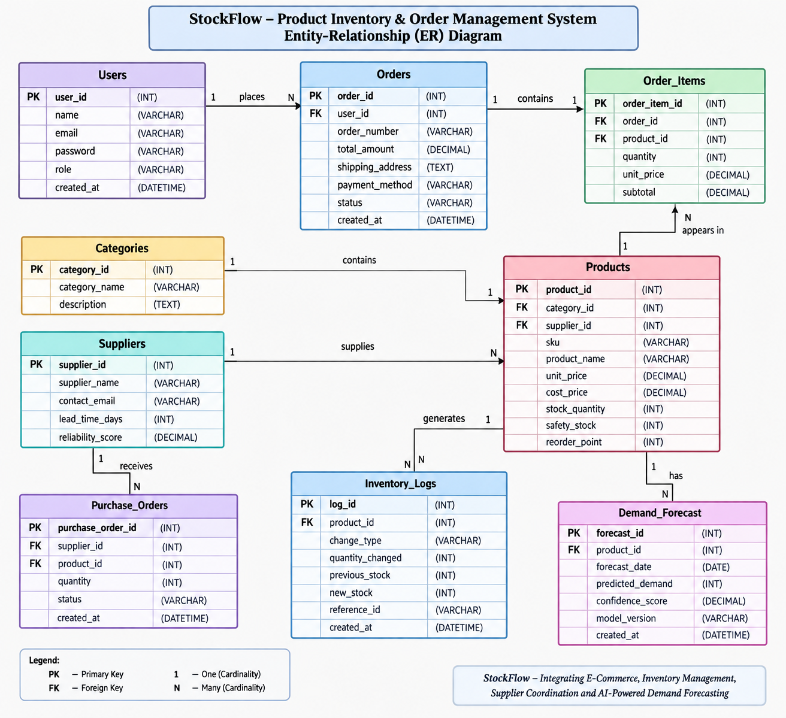

# NexStore: Enterprise Inventory & Order Management System

> **Corporate Relevance:** E-Commerce  
> **AI / Data Science Integration:** Inventory Analytics (Demand Forecasting, Dynamic Safety Stock, Reorder Point Optimization, ABC Pareto Stratification, and Stockout Risk Runway Scoring)

---

## 📁 System Architecture & Directory Structure

The project is structured into three clean, separate folders as requested:

```
├── frontend/               # React 19 + Vite + Tailwind CSS + Chart.js + Lucide Icons
│   ├── src/
│   │   ├── components/     # Navbar, Footer, Route Guards
│   │   ├── context/        # AuthContext (Customer & Admin), CartContext (with stock checks)
│   │   ├── pages/
│   │   │   ├── CustomerLogin.jsx       # Customer Login Portal
│   │   │   ├── CustomerRegister.jsx    # Customer Registration
│   │   │   ├── Shop.jsx                # E-Commerce Catalog with live stock badges & modals
│   │   │   ├── Cart.jsx                # Shopping Cart with stock bounding
│   │   │   ├── Checkout.jsx            # Order Placement & Immediate Stock Reservation
│   │   │   ├── CustomerOrders.jsx      # Order Tracking Timeline (Placed -> Processing -> Shipped -> Delivered)
│   │   │   ├── AdminLogin.jsx          # Dedicated Operations Admin Login Portal
│   │   │   ├── AdminDashboard.jsx      # High-level KPIs, Alerts, and Activity
│   │   │   ├── AdminInventory.jsx      # Live Stock Table, Restock Modals, CRUD & Audit Logs
│   │   │   ├── AdminAnalytics.jsx      # AI/DS Demand Forecasting Charts & Reorder Engine
│   │   │   ├── AdminOrders.jsx         # Fulfillment Registry & Cancel Auto-Restock
│   │   │   └── AdminSuppliers.jsx      # Vendor Directory & Inbound Purchase Orders
│   │   └── services/       # Centralized API fetch client with JWT
│   └── package.json
│
├── backend/                # Node.js + Express.js REST API
│   ├── src/
│   │   ├── config/db.js    # Smart MySQL Connection with Auto-Schema & Migration
│   │   ├── controllers/    # Auth, Products, Orders, Inventory, Suppliers, Analytics
│   │   ├── middleware/     # JWT Verification & Role-Based Access Control
│   │   ├── routes/         # REST API endpoints
│   │   └── services/
│   │       └── analyticsEngine.js # AI/DS Time-Series Forecasting & Safety Stock Math
│   ├── data/               # Local embedded relational DB backup
│   ├── .env                # Database & JWT configurations
│   ├── server.js           # Server entry point on port 5000
│   └── package.json
│
└── database/               # Relational Database Schema & Datasets
    ├── schema.sql          # 8 Normalized MySQL Tables (foreign keys, cascade, triggers)
    ├── seeds.sql           # Realistic tech e-commerce catalog, suppliers, and order histories
    ├── setup_mysql.bat     # Windows one-click MySQL import script
    └── README.md           # Database setup instructions
```

---

## ER Diagram


## 🔑 Login Credentials

The system provides **two distinct login portals**:

### 1. Customer Portal (`/customer-login`)
* **Role:** Shopper / Buyer
* **Email:** `customer@ecommerce.com`
* **Password:** `customer123`
* **Capabilities:** Browse live catalog, search and filter by category/stock, add items to cart, checkout with real-time stock deductions, and view interactive order delivery progress timelines.

### 2. Admin Portal (`/admin-login`)
* **Role:** Administrator / Logistics & Inventory Manager
* **Email:** `admin@ecommerce.com`
* **Password:** `admin123`
* **Capabilities:** 
  - Manage inventory levels, safety stocks, and reorder points.
  - Manual restock / count adjustment with automated audit logs in `inventory_logs`.
  - Process customer orders (Pending $\rightarrow$ Processing $\rightarrow$ Shipped $\rightarrow$ Delivered $\rightarrow$ Cancelled with auto-restock).
  - Manage vendors, lead times, and dispatch inbound Purchase Orders (POs).
  - Access the **AI/DS Inventory Analytics Hub**.

*(Note: Both login screens include an "Auto Fill" button for 1-click testing!)*

---

## 🧠 AI / DS Integration: Inventory Analytics Engine

The system contains mathematical and data science formulations in `backend/src/services/analyticsEngine.js`:

1. **Time-Series Demand Forecasting:**
   - Evaluates 30-day historical order checkout velocity: $V_d = \frac{\sum \text{quantity sold}}{\text{window days}}$.
   - Projects forward demand for 7-day, 14-day, and 30-day horizons.
   - Interactive Chart.js visualizer showing 7-day predicted trend curves for top velocity SKUs.

2. **Dynamic Safety Stock & Reorder Point (ROP):**
   - Standard static reorder points often cause stockouts or overstocking.
   - The engine computes dynamic Safety Stock:
     $$SS = Z \times \sigma_L \times \sqrt{L}$$
     Where $Z = 1.65$ (95% service level), $\sigma_L$ is the standard deviation of daily demand, and $L$ is supplier lead time in days.
   - Dynamic Reorder Point:
     $$ROP = (d_{\text{avg}} \times L) + SS$$

3. **Stockout Runway (Days of Supply) & Risk Classification:**
   $$\text{Runway} = \frac{\text{Current Stock Quantity}}{d_{\text{avg}}}$$
   - **CRITICAL:** Runway $\le$ Lead Time (imminent stockout risk!).
   - **LOW STOCK:** Runway $\le 2 \times$ Lead Time.
   - **OPTIMAL:** Balanced inventory holding.
   - **OVERSTOCKED:** Excess capital tied up.

4. **ABC Pareto Stratification:**
   - **Class A:** Top SKUs generating $\approx 75\%$ of cumulative revenue.
   - **Class B:** Middle SKUs generating $\approx 20\%$ of revenue.
   - **Class C:** Low velocity items generating $\approx 5\%$ of revenue.

5. **Inventory Health Index (0 to 100):**
   - Automatically penalizes critical stockouts and overstocked capital to provide an overall organizational health score.

6. **1-Click AI Automated Restock PO Generator:**
   - From the analytics matrix, admins can click **"Order +X Units"** to generate an inbound Purchase Order to the designated supplier.

---

## 🗄️ MySQL Database Setup

1. Open a terminal in `database/` and run:
   ```bash
   mysql -u root -p < schema.sql
   mysql -u root -p < seeds.sql
   ```
   Or double-click `database/setup_mysql.bat`.

2. The backend (`backend/src/config/db.js`) is pre-configured in `.env`:
   ```env
   DB_HOST=localhost
   DB_USER=root
   DB_PASSWORD=your_password
   DB_NAME=inventory_ecommerce_db
   DB_PORT=3306
   ```

*(Smart Dual Adapter: If MySQL service is ever stopped or not yet configured on a machine, the backend automatically falls back to an embedded relational SQLite database with the exact same relational schema and seeds so the application never fails!)*

---

## 🚀 How to Run the Application

### Option A: 1-Click Launch (Windows)
Double-click `start-all.bat` in the root folder.

### Option B: Terminal Launch
1. **Start Backend:**
   ```bash
   cd backend
   npm start
   ```
   *Runs on `http://localhost:5000`*

2. **Start Frontend:**
   ```bash
   cd frontend
   npm run dev
   ```
   *Runs on `http://localhost:5173`*
